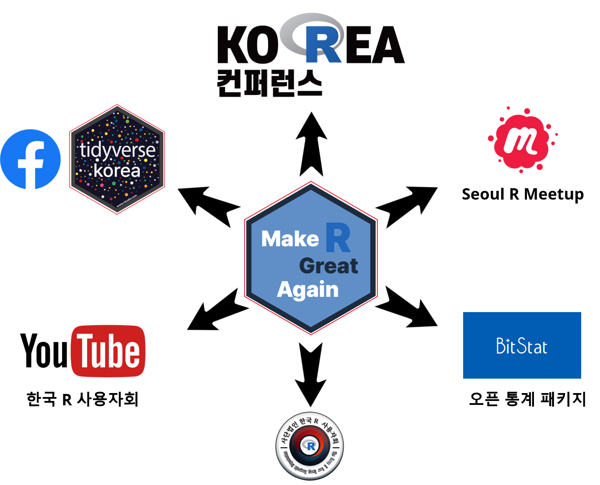
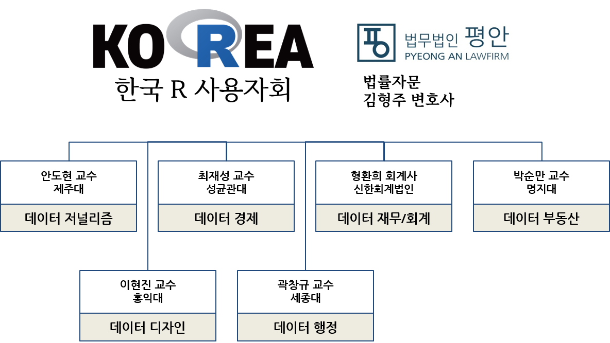

```{=html}
<style>
/* ── 소개 페이지 레이아웃 ── 기능 카드 + 이미지 프레임 (다른 페이지와 통일된 카드 UI) */
.about-img{
  border-radius:14px;
  max-width:80%; height:auto;      /* 그림자 제거 + 크기 축소 */
  display:block; margin:0.5rem auto;
}
.feat-grid{
  display:grid; grid-template-columns:repeat(auto-fit, minmax(230px, 1fr));
  gap:1.1rem; margin:1.25rem 0 2rem;
}
.feat-card{
  border:1px solid rgba(0,0,0,.08); border-radius:16px;
  padding:1.35rem 1.25rem; background:#fff;
  box-shadow:0 1px 3px rgba(0,0,0,.05);
  transition:transform .18s ease, box-shadow .18s ease;
}
.feat-card:hover{transform:translateY(-4px); box-shadow:0 12px 26px rgba(0,0,0,.1);}
.feat-ico{
  display:inline-flex; align-items:center; justify-content:center;
  width:2.6rem; height:2.6rem; border-radius:13px;
  background:rgba(68,112,153,.12); color:#447099; font-size:1.15rem;
  margin-bottom:.8rem;
}
.feat-card h4{margin:0 0 .5rem; font-size:1.04rem; font-weight:700; line-height:1.35;}
.feat-card p{margin:0; font-size:.9rem; line-height:1.6; color:#5b6570;}

@media (prefers-color-scheme: dark){
  .feat-card{background:#2c4f70; border-color:rgba(255,255,255,.12); color:#eceff3;}
  .feat-card h4{color:#f3f5f8;}   /* 어두운 카드 위에서 제목이 보이도록 흰색 */
  .feat-card p{color:#c2c9d2;}
  .feat-ico{background:rgba(143,188,232,.18); color:#8fbce8;}
}
</style>
```

::: {.callout-note appearance="simple"}
 **비영리 공익법인** · 2022년 설립 — 데이터 과학과 통계 대중화로 인공지능 시대의 디지털 불평등 해소에 힘쓰고 있습니다.
:::

## 한국 R 사용자회

한국 알(R) 사용자회는 2022년 2월에 설립된 비영리 공익법인입니다.

BitStat 오픈 통계 패키지 개발, 데이터 사이언스 전자책 콘텐츠 제작, 서울 R 미트업과 한국 R 컨퍼런스 개최 등 다양한 활동을 하고 있습니다. 또한 [나눔교육운동본부](https://www.sharingkorea.net/), [서울교육청 사회단체 교육활동](https://www.sen.go.kr/), [대전관광공사 민간분야 과학문화활동](http://www.djto.kr/) 등 여러 사업에 참여하고 있습니다.

이러한 활동을 통해 디지털 불평등 해소와 오픈 과학기술 보급에 힘쓰며, 더 나은 세상을 만들어가고 있습니다.

## R 언어

R은 과학, 통계, 데이터 사이언스, 바이오인포매틱스 등을 위한 도메인 특화 프로그래밍 언어입니다.

과거에는 SPSS, STATA, SAS, 미니탭 등 GUI 기반 통계 패키지가 통계 및 데이터 분석의 주류를 이루었습니다. 그러나 빅데이터 시대가 도래하고 데이터 사이언스와 챗GPT 같은 인공지능 기술이 부상하면서, 이제는 R과 파이썬이 널리 사용되고 있습니다.

R은 1992년 뉴질랜드 오클랜드 대학의 Robert Gentleman 교수와 Ross Ihaka 교수가 개발을 시작하였으며, 이후 GPL 라이선스 하에 소스코드가 공개되었습니다. 뒤이어 R 코어 그룹이 결성되고 패키지 배포를 위한 CRAN이 공개되었으며, 공식 웹사이트와 함께 2000년에는 R 1.0.0이 처음 배포되었습니다.

이후 R 저널, UseR! 컨퍼런스, R 재단, R 컨소시엄 등이 설립되었고, 전 세계 수많은 재능 있고 열정적인 사람들이 R의 발전에 기여해왔습니다. [^r-history]

[^r-history]: [R (programming language)](https://en.wikipedia.org/wiki/R_(programming_language))

한국에서는 2017년부터 R Meetup이 시작되었고, 2021년에는 한국 R 컨퍼런스가 개최되었습니다. 이어 2022년에는 사단법인 한국 R 사용자회가 설립되어 활발한 활동을 이어가고 있습니다. [^r-korea]

[^r-korea]: [데이터 과학과 R 언어](https://statkclee.github.io/data-science/ds-r-lang.html)

## R 장점

::: {.feat-grid}
::: {.feat-card}
[]{.feat-ico}

#### 통계 분석에 최적화

회귀·시계열·다변량·공간 분석부터 기계학습·딥러닝까지, 다양한 통계 모형을 효율적으로 다룹니다.
:::
::: {.feat-card}
[]{.feat-ico}

#### 강력한 데이터 시각화

ggplot2, plotly 등 풍부한 패키지로 고급 데이터 시각화를 구현할 수 있습니다.
:::
::: {.feat-card}
[]{.feat-ico}

#### 풍부한 패키지 생태계

공식·커뮤니티가 제공하는 수천 개의 패키지로 데이터 처리·분석·모델 개발을 손쉽게 수행합니다.
:::
::: {.feat-card}
[]{.feat-ico}

#### 활발한 커뮤니티 지원

한국을 포함한 전 세계 사용자 커뮤니티에서 문제 해결과 정보 공유가 활발하게 이루어집니다.
:::
:::

## 왜 R에 대한 학술연구가 필요한가

::: {.feat-grid}
::: {.feat-card}
[]{.feat-ico}

#### 통계적 방법론의 발전

R이 지원하는 다양한 통계 방법론에 대한 학술 연구는 분석 결과의 정확성과 신뢰성을 높입니다.
:::
::: {.feat-card}
[]{.feat-ico}

#### 도구 활용의 효율성 제고

강력한 데이터 처리·분석 기능을 각 분야에 맞게 활용하려면 연구가 필요합니다. 특히 영어 환경의 한글화·매뉴얼·경험 공유가 요구됩니다.
:::
::: {.feat-card}
[]{.feat-ico}

#### 언어의 효율성과 사용성 향상

R 언어 자체에 대한 연구는 효율성과 사용성을 높여, 더 쉽게 배우고 활용할 방법을 만들어냅니다.
:::
:::

## 커뮤니티 네트워크

::: {.row .align-items-center}
::: {.col-md-6}
{.about-img}
:::
::: {.col-md-6}
-   [한국 알(R) 사용자회](https://r2bit.com/)
-   [한국 알(R) 사용자회 페이스북](https://www.facebook.com/groups/tidyverse)
-   [Seoul R Meetup](https://www.meetup.com/seoul-r-meetup)
    -   [Seoul R Meetup (Repository)](https://r2bit.com/seoul-r)
    -   [Asia R Community](https://github.com/AsiaR-community)
    -   [Global R Meetup](https://benubah.github.io/r-community-explorer/rugs.html)
-   [Korea R Conference](https://use-r.kr/)
-   [YouTube 채널](https://www.youtube.com/channel/UCW-epmIvjBEhhVXw_F0Nqbw)
-   [Slack](https://korea-r-user-group.slack.com)
:::
:::

## 한국 R 사용자회 기여 및 참여

한국 R 사용자회는 오픈 통계 및 데이터 패키지 개발, 오픈 콘텐츠 제작, 오픈 교육 및 컨설팅 등 다양한 활동을 통해 과학기술 발전과 디지털 불평등 해소에 기여하고 있습니다.

현재 데이터 저널리즘 분과와 데이터 경제 분과를 중심으로 운영되고 있으며, 법무법인 평안의 김형주 변호사님이 고문 변호사로 함께하고 계십니다.

{.about-img fig-align="center"}

## 연락처

::: {.callout-note appearance="simple"}
  문의: [admin@bit2r.com](mailto:admin@bit2r.com)
:::
