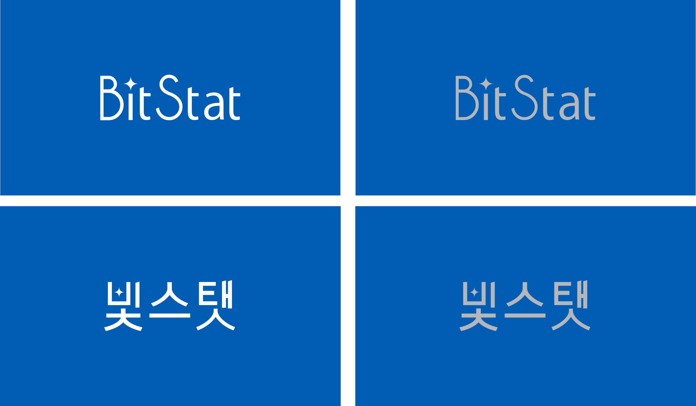

```{r setup, include=FALSE}
knitr::opts_chunk$set(echo = FALSE)
```



# 프로젝트 개요

코로나19로 인해 심화된 **디지털 불평등**과 **디지털 경제 전환(Digital Transformation)**으로 인해 시민의 필수 역량이 된 **Data Literacy 역량 강화**를 위해 컴퓨터를 처음 접하거나 데이터 작업이 처음인 대한민국 국민 누구나 쉽게 통계 팩키지를 접할 수 있도록 하고 데이터 프로그래밍 역량도 수준별로 강화할 수 있도록 새로운 형태의 블록 통계 분석을 포함한 **초중등 오픈 통계 팩키지 개발**을 금번 컨트리뷰션 아카데미 프로그램을 빌어 Tidyverse Korea 멘토와 멘티가 함께 2021년 새로운 여행을 함께 떠나가고자 합니다.

# 기대 효과

- 프로젝트 멘티의 기대 효과
    - R/Shiny로 동적 웹 애플리케이션을 개발할 수 있는 방법을 터득합니다.
    - 자신만의 R 패키지를 개발하고, Github과 CRAN에 등록할 수 있습니다.
    - 통계 패키지의 동작 방법을 이해할 수 있습니다. 
- 프로젝트 멘티의 오픈소스 생태계 기여
    - 오픈통계 패키지 프레임워크 개발 참여로, 오픈통계 패키지 기틀 마련에 기여합니다.
    - 영문 패키지 도움말의 한글화로, 국내 사용자의 패키지 활용도 제고에 기여합니다.

# `tidyblocks`

- Tidy Blocks 한글화 지원 : <https://github.com/tidyblocks/tidyblocks/>
- Tidy Blocks 블록 통계 프로그래밍 안내서 한글 번역: <https://tidyblocks.tech/en/guide/>
- 한글 사례(Example) 추가 및 확대 : <https://tidyblocks.tech/en/examples/>

# 글로벌 실전 `dlookr` 팩키지 CRAN 한글화

- `dlookr` 패키지의 사용자 가이드 한글화
    - <https://github.com/choonghyunryu/dlookr>
    - <https://choonghyunryu.github.io/dlookr/>
- 소품(Vignettes)
    - Introduce dlookr, Data Diagnosis, EDA, Data Transformation
    - <https://github.com/choonghyunryu/dlookr/tree/master/vignettes>
- 도움말(Manpages)
    - 목록 : <https://choonghyunryu.github.io/dlookr/reference/index.html>
    - 소스 : <https://github.com/choonghyunryu/dlookr/tree/master/man>

# 오픈 통계 패키지 R/Shiny 개발

- 초중등 통계 교육 및 Data Literacy 향상을 위한 R/Shiny 앱 개발
- 초중등 통계 교육에 필요한 기능 식별
- Shiny UI 설계/구현
- Shiny server 로직 설계/구현

참고: [통그라미](https://mdis.kostat.go.kr/tong/index.html)

# [한국 R 컨퍼런스](https://use-r.kr/) 발표

- [발표자](https://use-r.kr/speaker.html)
- [정규 프로그램](https://use-r.kr/program.html)

# 참고자료

- [국산 오픈 통계 팩키지](https://docs.google.com/presentation/d/1v5gu8pTHMcRUei8II4eGB5367fGRZJlRzML9v0U9QdE/edit?usp=sharing)
- [2021 오픈소스 컨트리뷰션 아카데미 - Tidyverse Korea 데이터 과학](https://contributionacademy.oopy.io/)
- [오픈 통계 팩키지 개발 안내서](https://docs.google.com/presentation/d/1xXQ_DzjSaS24Kr7c_rqiaAr5GqP5gsEKujq5fQNy-MA/edit?usp=sharing)


