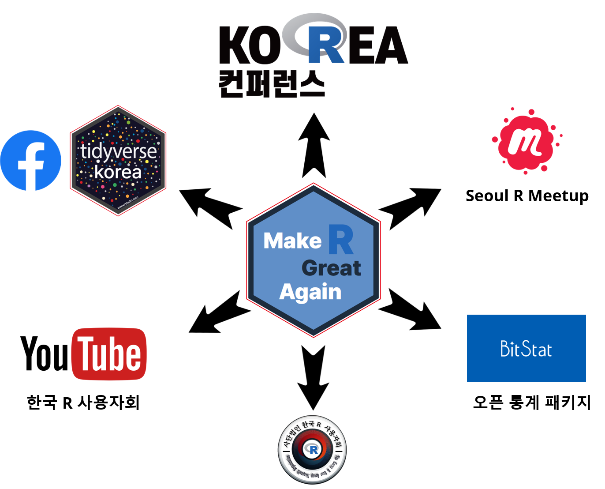

```{r setup, include=FALSE}
knitr::opts_chunk$set(echo = FALSE)
```




- 한국 알(R) 사용자회: [link](https://r2bit.com/)
- 한국 알 사용자회 페이스북: [link](https://www.facebook.com/groups/tidyverse)
- **Seoul R Meetup**: [link](https://www.meetup.com/seoul-r-meetup)
    - Seoul R Meetup: [link](https://tidyverse-korea.github.io/seoul-R/)
    - Asia R Community [link](https://github.com/AsiaR-community)
    - Global R Meetup: [link](https://benubah.github.io/r-community-explorer/rugs.html)
- AISpiration: [link](https://aispiration.com/)
- Korea R Conference: [link](https://use-r.kr/)
- Youtube Channel: [link](https://www.youtube.com/channel/UCW-epmIvjBEhhVXw_F0Nqbw)


