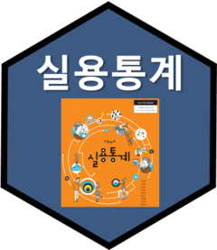

```{r setup, include=FALSE}
knitr::opts_chunk$set(echo = FALSE)
```

# 고등학교 실용통계 교과서

|                     패키지명                     |                                                                            데이터 패키지 설명                                                                            |                 로고                 |
|:------------------------------------------------:|:------------------------------------------------------------------------------------------------------------------------------------------------------------------------:|:------------------------------------:|
|      [`hsData`](https://r2bit.com/hsData/)       |                                                         통계청 통계교육원에서 발간한 "고등학교 실용통계" 교과서                                                          | {width="73"} |
| [krvote](https://ai-carpentry.github.io/krvote/) | [중앙선거관리위원회](https://www.nec.go.kr/site/nec/main.do) [선거통계시스템](http://info.nec.go.kr/main/main_load.xhtml)에 공개된 역대 선거관련 투표와 득표 공공 데이터 | {width="73"} |
|                                                  |                                                                                                                                                                          |                                      |
