```{r setup, include=FALSE}
knitr::opts_chunk$set(echo = FALSE)
```

```{=html}
<style>
/* ── 홈 전용 히어로/카드/애니메이션 (이 페이지에만 적용) ── */
#title-block-header{display:none;}   /* 기본 타이틀 블록 숨김 — 히어로로 대체 */

.home-hero{
  position:relative; overflow:hidden;
  margin:-0.5rem 0 2rem; padding:3.6rem 1.5rem; border-radius:20px;
  text-align:center; color:#fff; background-color:#2c4f70;
  background-image:
    radial-gradient(rgba(255,255,255,.08) 1px, transparent 1.3px),
    linear-gradient(135deg,#24405c 0%, #2c4f70 55%, #3a6690 100%);
  background-size:22px 22px, cover;
  animation:homeFadeUp .7s ease both;
}
.home-hero-title{
  font-family:'Paperlogy',sans-serif; font-weight:800; letter-spacing:-.02em;
  font-size:clamp(2rem,5vw,3.2rem); line-height:1.15; margin:0 0 .7rem; color:#fff;
}
.home-hero-title .hero-r{color:#8fd0ff;}
.home-hero-tagline{
  font-size:clamp(1rem,2.2vw,1.22rem); color:rgba(255,255,255,.92);
  max-width:640px; margin:0 auto 1.7rem; line-height:1.6;
}
.home-hero-cta{display:flex; gap:.75rem; justify-content:center; flex-wrap:wrap;}
.hero-btn{
  display:inline-block; padding:.7rem 1.5rem; border-radius:999px;
  font-weight:600; font-size:.98rem; text-decoration:none;
  transition:transform .15s ease, box-shadow .15s ease;
}
.hero-btn.primary{background:#fff; color:#2c4f70; box-shadow:0 4px 14px rgba(0,0,0,.2);}
.hero-btn.ghost{background:rgba(255,255,255,.12); color:#fff; border:1px solid rgba(255,255,255,.55);}
.hero-btn:hover{transform:translateY(-2px); box-shadow:0 8px 22px rgba(0,0,0,.28); text-decoration:none;}

.home-cards{
  display:grid; grid-template-columns:repeat(auto-fit, minmax(210px,1fr));
  gap:1.1rem; margin:0 0 2.75rem; animation:homeFadeUp .7s .12s ease both;
}
.home-card{
  display:block; text-decoration:none; color:inherit;
  border:1px solid rgba(0,0,0,.08); border-radius:16px; padding:1.5rem 1.35rem;
  background:#fff; box-shadow:0 1px 3px rgba(0,0,0,.05);
  transition:transform .18s ease, box-shadow .18s ease, border-color .18s ease;
}
.home-card:hover{transform:translateY(-5px); box-shadow:0 14px 30px rgba(0,0,0,.12); border-color:rgba(68,112,153,.5); text-decoration:none;}
.home-card .hc-ico{
  display:inline-flex; align-items:center; justify-content:center;
  width:3rem; height:3rem; border-radius:14px;
  background:rgba(68,112,153,.12); color:#447099; font-size:1.4rem; margin-bottom:.85rem;
}
.home-card h3{margin:0 0 .4rem; font-size:1.1rem; font-weight:700; color:#18181b;}
.home-card p{margin:0; font-size:.88rem; color:#5b6570; line-height:1.55;}

@keyframes homeFadeUp{from{opacity:0; transform:translateY(18px);} to{opacity:1; transform:none;}}
</style>

<div class="home-hero">
  <h1 class="home-hero-title">한국 <span class="hero-r">R</span> 사용자회</h1>
  <p class="home-hero-tagline">데이터 과학과 통계 대중화로 디지털 불평등을 해소하는 공익법인입니다. 오픈 패키지·전자책 제작과 교육·워크샵으로 인공지능 시대의 격차를 줄여갑니다.</p>
  <div class="home-hero-cta">
    <a class="hero-btn primary" href="activities.html">활동·교육 보기</a>
    <a class="hero-btn ghost" href="donation.html">후원하기</a>
  </div>
</div>

<div class="home-cards">
  <a class="home-card" href="packages.html">
    <span class="hc-ico"><i class="fa-solid fa-cubes"></i></span>
    <h3>공개 패키지</h3>
    <p>dlookr·bitStat 등 분야별 R 패키지를 직접 개발합니다.</p>
  </a>
  <a class="home-card" href="book.html">
    <span class="hc-ico"><i class="fa-solid fa-book"></i></span>
    <h3>발행 도서</h3>
    <p>챗GPT 시리즈와 오픈 전자책으로 지식을 나눕니다.</p>
  </a>
  <a class="home-card" href="data.html">
    <span class="hc-ico"><i class="fa-solid fa-database"></i></span>
    <h3>공개 데이터</h3>
    <p>교육·연구·현업용 오픈 데이터셋을 제공합니다.</p>
  </a>
  <a class="home-card" href="activities.html">
    <span class="hc-ico"><i class="fa-solid fa-chalkboard-user"></i></span>
    <h3>활동·교육</h3>
    <p>대학·공공·기업 대상 워크샵과 AI 실무 교육을 진행합니다.</p>
  </a>
</div>
```

## 챗GPT 출판

:::{.panel-tabset}
### 챗GPT 시리즈

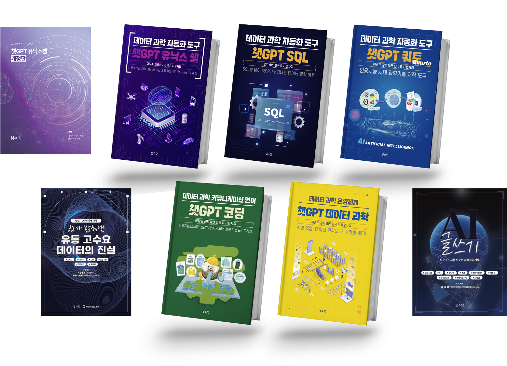{fig-align="center"}

### 고수요 데이터

::: {#chatGPT-retail layout-ncol="2"}

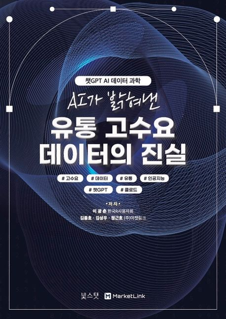{fig-align="center" width="250"}

:::

-  [교보 POD 종이책](https://product.kyobobook.co.kr/detail/S000218304161)
-  [교보 전자책](https://ebook-product.kyobobook.co.kr/dig/epd/ebook/E000012087955)
-  [웹사이트](https://statkclee.github.io/gpt-retail/)

### 데이터 과학

::: {#chatGPT-ds layout-ncol="2"}

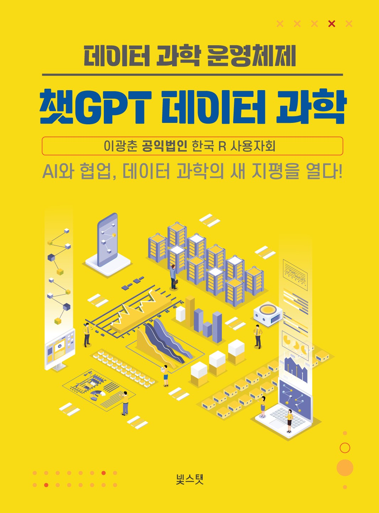{fig-align="center" width="250"}

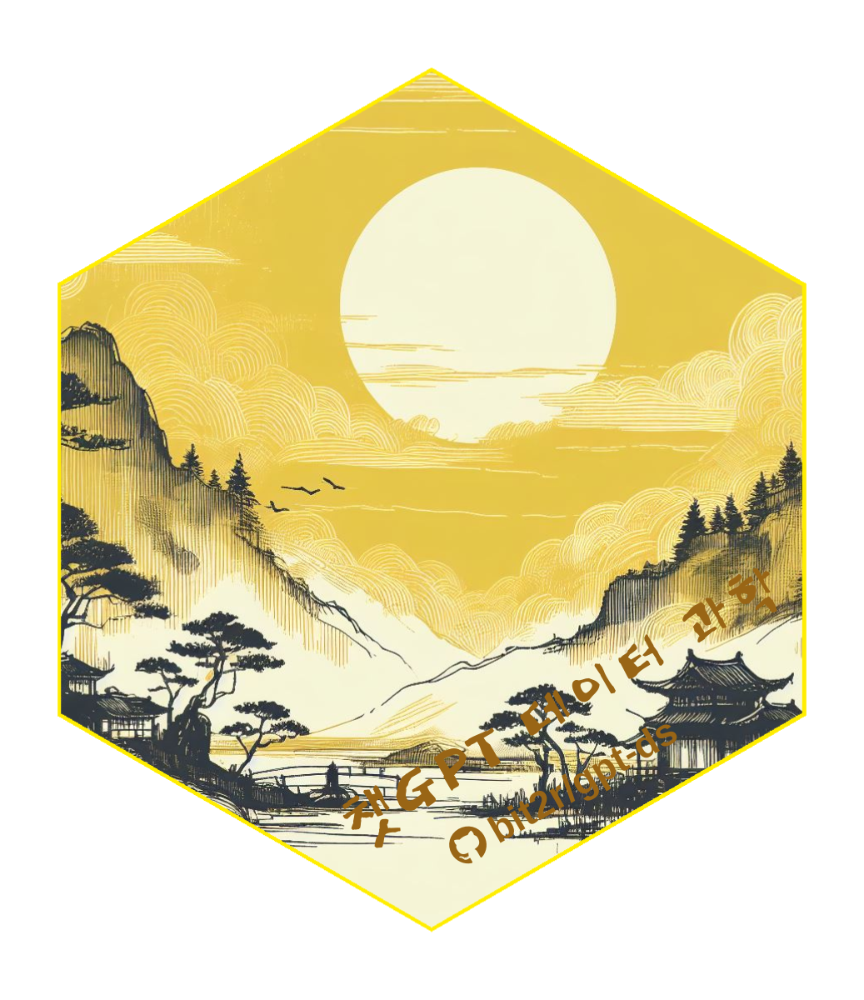{fig-align="center" width="300"}
:::

-  [교보 POD 종이책](https://bit.ly/4cVDxxL)
-  [교보 전자책](https://bit.ly/4dccQ8n)
-  [웹사이트](https://bit.ly/4909pOB)
-  [소스코드](https://bit.ly/3wXugES)

### 코딩

::: {#chatGPT-coding layout-ncol="2"}

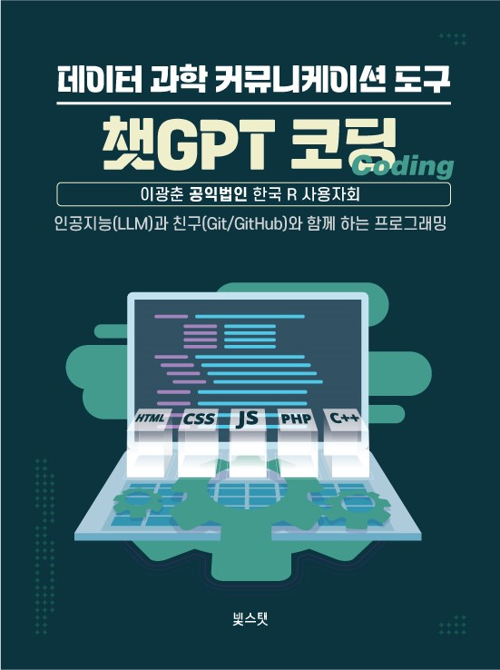{fig-align="center" width="250"}

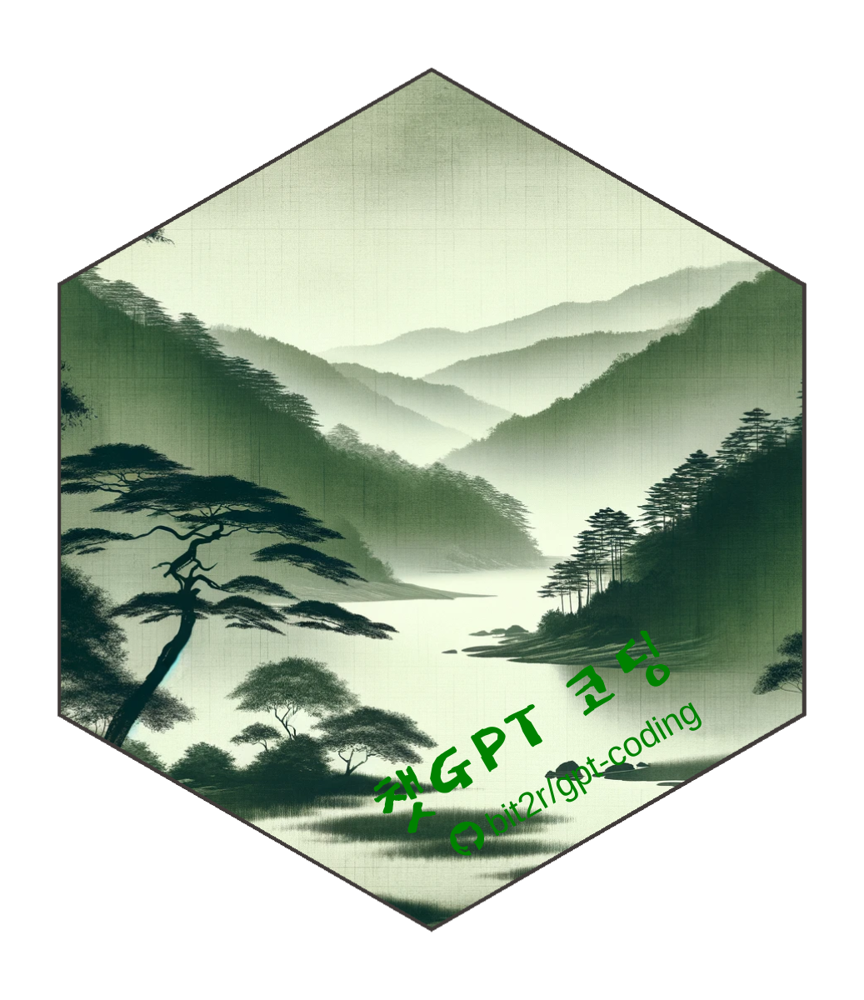{fig-align="center" width="300"}
:::

-  [교보 POD 종이책](https://bit.ly/4a8v1JS)
-  [교보 전자책](https://bit.ly/4auasHU)
-  [웹사이트](https://bit.ly/48V8u1T)
-  [소스코드](https://bit.ly/48RqMB9)

### AI 글쓰기

::: {#chatGPT-writing layout-ncol="2"}
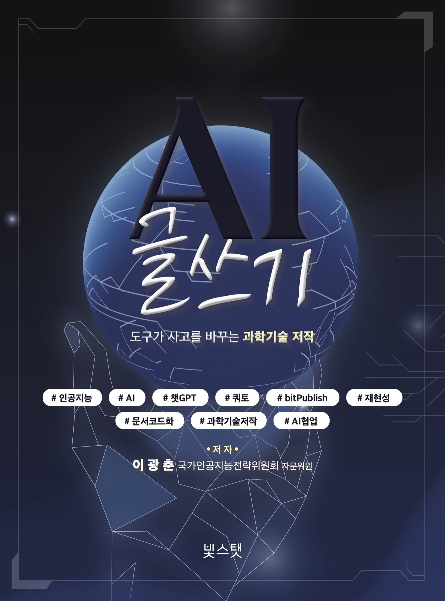{fig-align="center" width="250"}

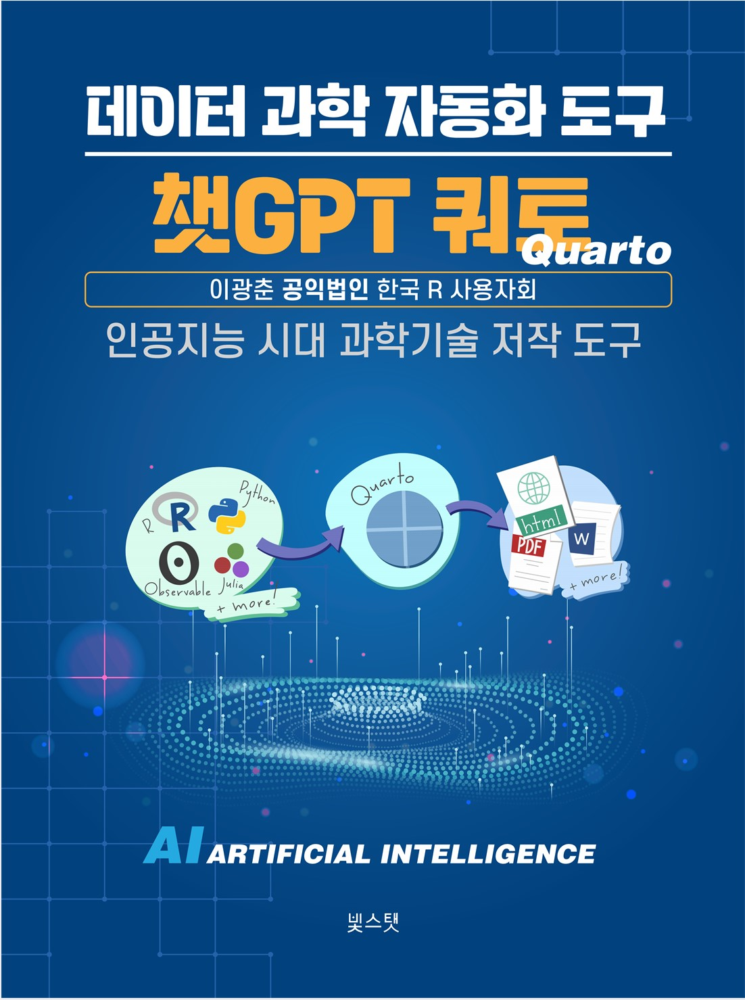{fig-align="center" width="250"}
:::

-  [교보 POD 종이책](https://bit.ly/3wElKuk)
-  [교보 전자책](https://ebook-product.kyobobook.co.kr/dig/epd/ebook/E000012272268)

### SQL

::: {#chatGPT-sql layout-ncol="2"}
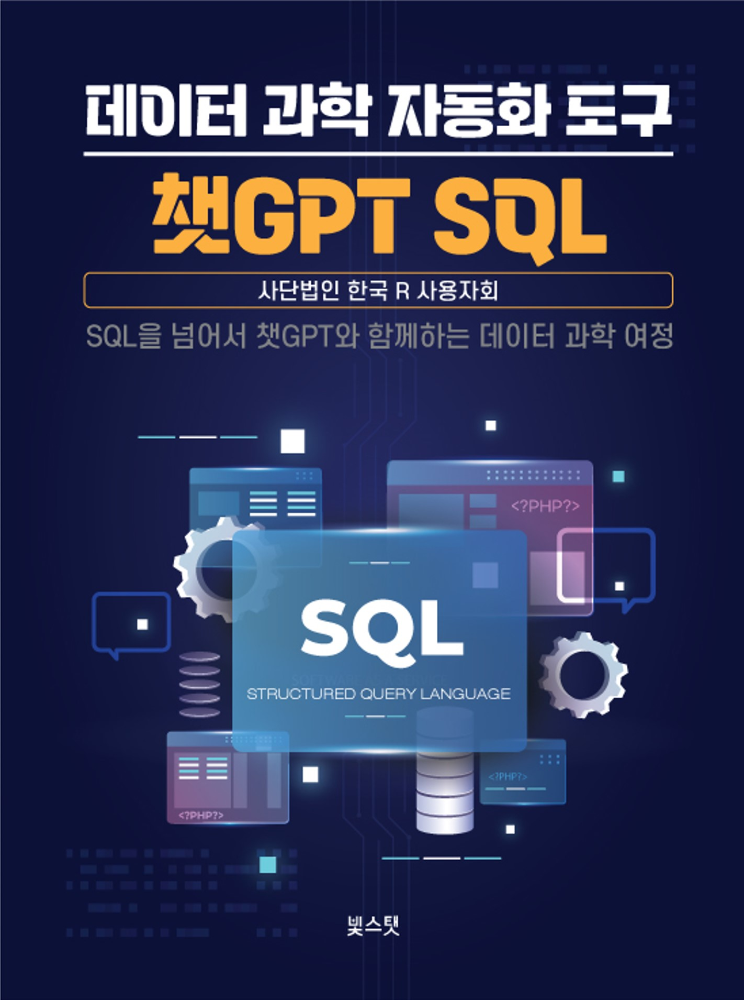{fig-align="center" width="250"}

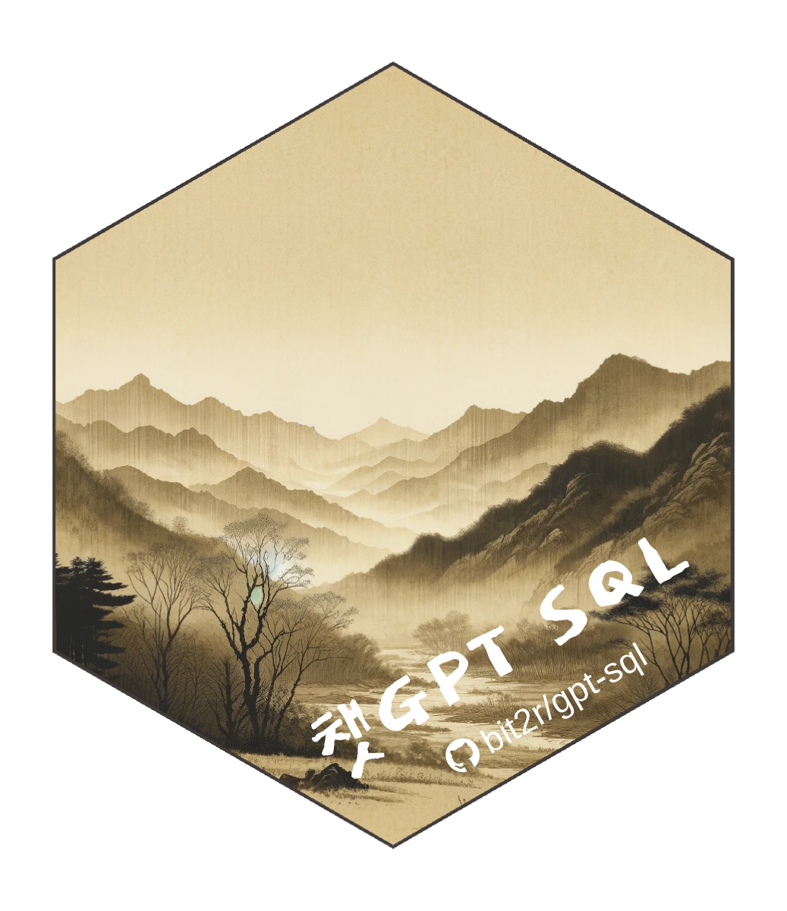{fig-align="center" width="300"}
:::

-  [교보 POD 종이책](https://bit.ly/3OJmMeT)
-  [교보 전자책](https://bit.ly/48fujZD)
-  [웹사이트](https://bit.ly/48gYn7d)
-  [소스코드](https://bit.ly/3wrgeuP)

### 유닉스 셸

::: {#chatGPT-shell layout-ncol="2"}
{fig-align="center" width="250"}

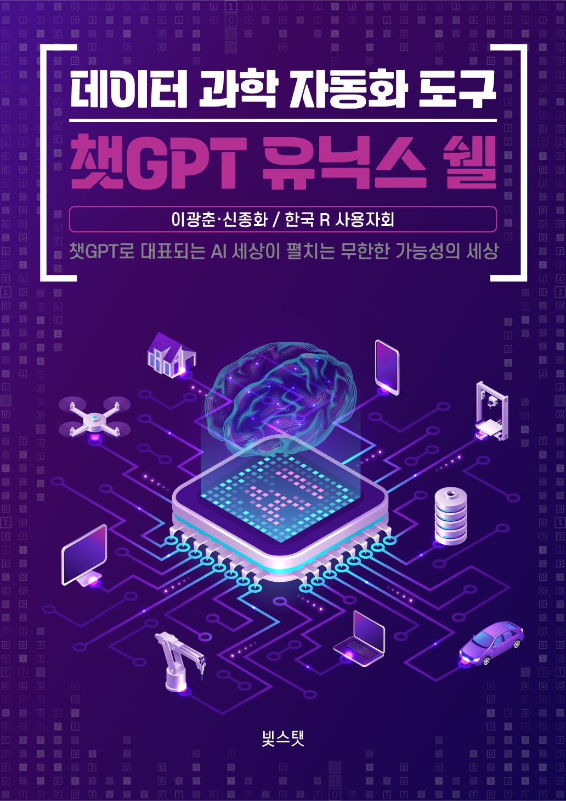{fig-align="center" width="250"}
:::

-  [교보 POD 종이책 (개정판)](https://product.kyobobook.co.kr/detail/S000218008711)
-  [교보 전자책 (개정판)](https://ebook-product.kyobobook.co.kr/dig/epd/ebook/E000011929412)
-  [뉴스 기사 — 챗GPT가 던진 새 가능성, 데이터 과학 분야 통해 미리 살펴보기](https://omn.kr/25f0i)

:::

## 교육·워크샵 활동

한국 R 사용자회는 대학·공공·기업을 대상으로 데이터 과학과 인공지능(AI) 실무 교육을 이어가고 있습니다. 세종대 소프트웨어 카펜트리 + AI 워크샵, 여론·설문조사 기업 대상 AI 실무 교육 등을 진행하고 있습니다.

자세한 내역은 [활동·교육 페이지](activities.qmd)에서 확인하실 수 있습니다.

## 서울 R 미트업

R Consortium R User Groups에 등록된 Seoul R Meetup은 매월 개최되는 데이터 사이언스 R/Tidyverse 미트업입니다. ChatGPT, Data Analytics, Tidyverse, Tidymodels, Shiny, Dashboard, Machine Learning, Digital Writing, Quarto/RMarkdown, Deep Learning 등 통계, AI/ML/DL, 데이터 사이언스, 시각화, 제품 개발 등을 실제 현장에서 직접 데이터를 다루는 분들, 학교와 연구소에서 연구 개발을 하시는 분들뿐만 아니라 관심 있는 분들이 함께 모여 교류하고 지식을 나누는 미트업입니다.

 **[서울 R 미트업 (meetup.com)](https://www.meetup.com/seoul-r-meetup)**

기타 커뮤니티 관련 링크는 아래와 같습니다.

- [세계 R 미트업 현황 (Global R Meetup Dashboard)](https://r-community.org/usergroups/)
- [한국 R 사용자회 (Korea R User Group)](https://r2bit.com/)
- [한국 R 컨퍼런스 (Korea R Conference)](https://use-r.kr/)
- [서울 R 미트업 아카이브 (Seoul R Meetup)](https://r2bit.com/seoul-r)
- [유튜브 채널 (YouTube)](https://www.youtube.com/channel/UCW-epmIvjBEhhVXw_F0Nqbw)
- [페이스북 그룹 (Facebook)](https://www.facebook.com/groups/tidyverse)
- [슬랙 (Slack)](https://korea-r-user-group.slack.com)

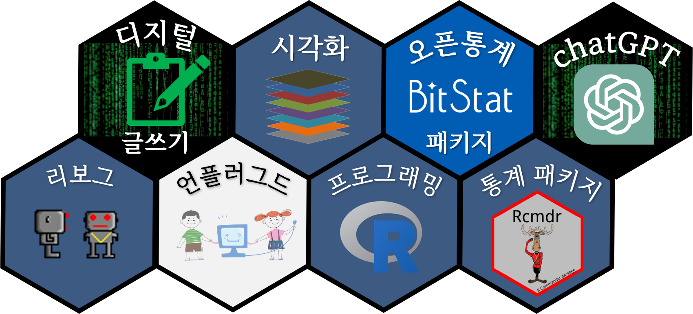{fig-align="center" width="50%"}

## 공익법인 후원

한국 R 사용자들을 위한 특별한 기회, 여러분의 후원으로 더욱 강력해지세요!

 **전문적인 R/쿼토 지원**

서울 R 사용자 모임의 일원이 되어 R/쿼토의 복잡한 문제를 해결하는 데 필요한 전문적인 도움을 받으세요. 여러분의 데이터 분석 여정을 쉽고 효율적으로 만들어 드립니다! [디스코드](https://discord.gg/4APU9Y8j) 질의응답 채널에 참여하여 적극적으로 질문하고 답변을 주고받으세요.

 **전자 기부금 영수증**

모든 후원에 대해 전자 기부금 영수증을 발급해 드리며, 여러분의 후원이 어떻게 사용되는지 투명하게 보여 드립니다. 여러분의 기여가 커뮤니티에 얼마나 중요한지 알 수 있습니다.

 **서울 R 밋업에서 배우는 선진 데이터과학 기술**

후원자 여러분은 서울 R 밋업 행사에 우선적으로 초대되어, 업계 선두 주자들로부터 최신 R/쿼토 기술과 트렌드를 배울 수 있는 기회를 얻습니다. 네트워킹과 지식 공유의 장에서 여러분의 역량을 한 단계 업그레이드하세요!

여러분의 후원은 우리 모두에게 가치 있는 지식과 기술을 전파하는 데 큰 도움이 됩니다. 지금 바로 공익법인 한국 R 사용자 모임의 후원자가 되어, 데이터 과학 커뮤니티를 더욱 강력하게 만드세요!

### 회원가입 및 기부금 신청

**회원가입 신청**

 [회원가입 신청서 작성하기](https://forms.gle/1gF8QezVPa8ur7617)

**후원 계좌**

하나은행 448-910062-30904 / 사단법인 한국알사용자회

**후원금**

2만 원 이상

**후원금 납부(약정) 후 기부금 영수증 발급 신청**

 [기부금 영수증 발급 신청서 작성하기](https://forms.gle/MEwLjasSaYj4a72k6)

