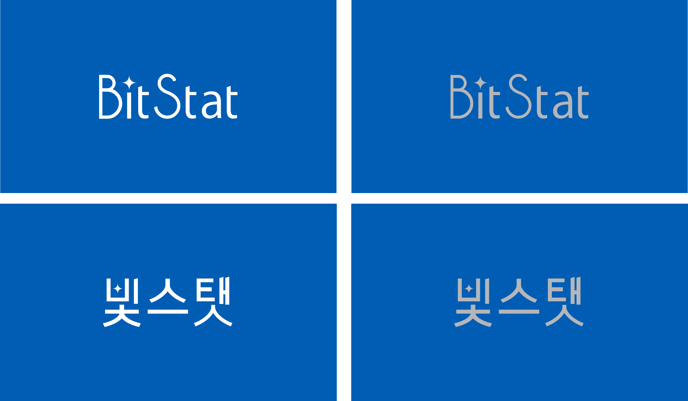
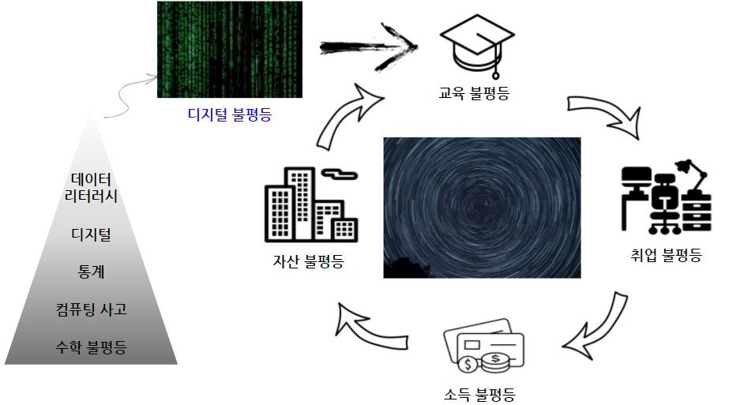
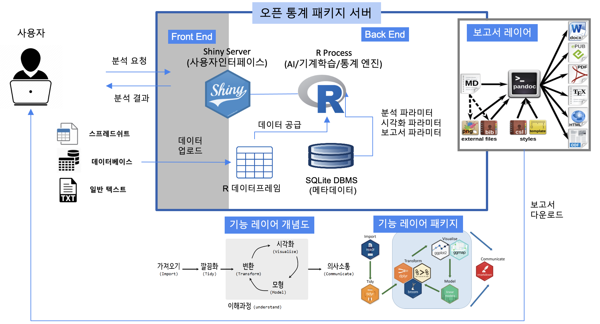
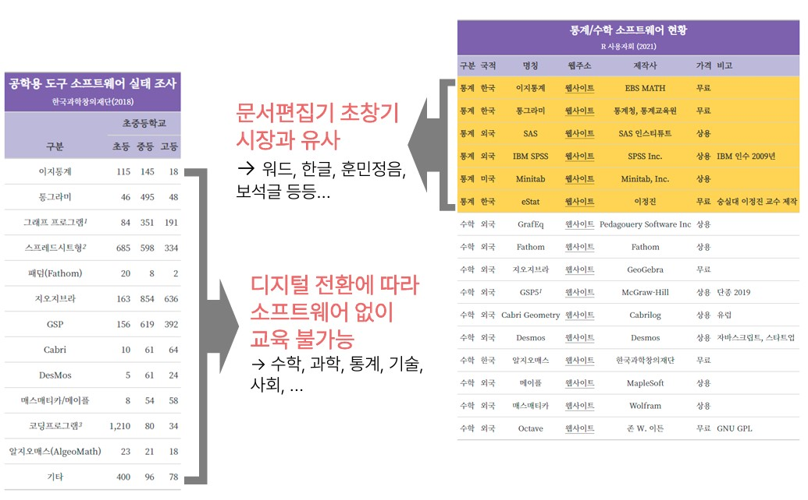

```{r setup, include=FALSE}
knitr::opts_chunk$set(echo = FALSE, message=FALSE, warning=FALSE,
                      comment = "#>",
                      digits = 3, tidy = FALSE, prompt = FALSE, fig.align = 'center')

library(tidyverse)

# ── 패키지 카드 생성기 ────────────────────────────────────────────
# 패키지 정보 tibble 을 받아 반응형 카드 그리드 HTML 문자열을 반환한다.
# source 값에 따라 배지를 달리한다: CRAN(파랑) / GitHub(회색).
pkg_cards <- function(df) {
  one <- function(title, image, text, link, date, source) {
    badge_cls <- if (source == "CRAN") "is-cran" else "is-repo"
    date_html <- if (!is.na(date) && nzchar(date)) sprintf('<span class="bk-date">%s</span>', date) else '<span></span>'
    sprintf(paste0(
      '<a class="bk-card" href="%s">',
      '<div class="bk-cover"><span class="bk-badge %s">%s</span>',
      '</div>',
      '<div class="bk-body"><h3 class="bk-title font-bitstat">%s</h3>',
      '<p class="bk-text">%s</p>',
      '<div class="bk-foot">%s<span class="bk-cta">자세히 &rarr;</span></div></div></a>'),
      link, badge_cls, source, image, title, title, text, date_html)
  }
  inner <- purrr::pmap_chr(df, one)
  paste0('<div class="bk-grid">', paste(inner, collapse = ""), '</div>')
}
```

```{=html}
<style>
/* ── 패키지 카드 그리드 ── 발행 도서 페이지와 동일한 카드 UI (반응형·호버·다크모드) */
.bk-grid{
  display:grid;
  grid-template-columns:repeat(auto-fill, minmax(230px, 1fr));
  gap:1.5rem;
  margin:1.75rem 0 2.5rem;
}
.bk-card{
  display:flex; flex-direction:column;
  border:1px solid rgba(0,0,0,.08);
  border-radius:16px; overflow:hidden;
  background:#fff; color:inherit; text-decoration:none;
  box-shadow:0 1px 3px rgba(0,0,0,.05);
  transition:transform .18s ease, box-shadow .18s ease, border-color .18s ease;
}
a.bk-card:hover{
  transform:translateY(-5px);
  box-shadow:0 14px 30px rgba(0,0,0,.13);
  border-color:rgba(68,112,153,.55); /* navbar 색(#447099) 계열 강조 */
}
/* 표지(로고) 영역 — 정사각 로고를 가운데 정렬. 밝은 배경으로 투명 PNG 로고도 선명하게 */
.bk-cover{
  position:relative;
  aspect-ratio:3 / 4;
  display:flex; align-items:center; justify-content:center;
  padding:1.5rem;
  background:linear-gradient(135deg, #f5f7fa, #e8edf3);
}
.bk-cover img{max-width:100%; max-height:100%; object-fit:contain; border-radius:5px;}
/* 출처 배지 */
.bk-badge{
  position:absolute; top:.65rem; left:.65rem;
  font-size:.72rem; font-weight:600; color:#fff;
  padding:.2rem .6rem; border-radius:999px;
  letter-spacing:.01em;
}
.bk-badge.is-cran{background:#2b6cb0;} /* CRAN 등록 */
.bk-badge.is-repo{background:#4a5568;} /* GitHub 저장소 */
/* 본문 */
.bk-body{display:flex; flex-direction:column; gap:.55rem; flex:1; padding:1.05rem 1.15rem 1.2rem;}
.bk-title{margin:0; font-size:1.03rem; font-weight:700; line-height:1.4;}
.bk-text{
  margin:0; font-size:.88rem; color:#5b6570; line-height:1.6;
  display:-webkit-box; -webkit-line-clamp:3; -webkit-box-orient:vertical; overflow:hidden;
}
.bk-foot{margin-top:auto; display:flex; align-items:center; justify-content:space-between; padding-top:.5rem;}
.bk-date{font-size:.78rem; color:#8a929b;}
.bk-cta{font-size:.83rem; font-weight:600; color:#447099;}

/* 다크모드 대응 — 표지(로고) 영역은 밝게 유지, 본문만 다크 톤 */
@media (prefers-color-scheme: dark){
  .bk-card{background:#2c4f70; border-color:rgba(255,255,255,.12); color:#eceff3;}
  .bk-title{color:#f3f5f8;}
  .bk-text{color:#c2c9d2;}
  .bk-date{color:#98a0aa;}
  .bk-cta{color:#8fbce8;}
}

/* ── 오픈 통계 패키지 상세 섹션 ── 이미지·기대효과 카드 정돈 */
/* 섹션 내 이미지에 둥근 모서리와 부드러운 그림자 */
.pkg-detail img{border-radius:12px; box-shadow:0 6px 22px rgba(0,0,0,.09); max-width:100%; height:auto;}
/* 기대 효과 3열 카드 */
.feat-grid{display:grid; grid-template-columns:repeat(auto-fit, minmax(230px, 1fr)); gap:1.25rem; margin:1.5rem 0 2.25rem;}
.feat-card{
  border:1px solid rgba(0,0,0,.08); border-radius:16px;
  padding:1.5rem 1.35rem; background:#fff;
  box-shadow:0 1px 3px rgba(0,0,0,.05);
  transition:transform .18s ease, box-shadow .18s ease;
}
.feat-card:hover{transform:translateY(-4px); box-shadow:0 12px 26px rgba(0,0,0,.1);}
/* 아이콘 배지 */
.feat-ico{
  display:inline-flex; align-items:center; justify-content:center;
  width:2.7rem; height:2.7rem; border-radius:13px;
  background:rgba(68,112,153,.12); color:#447099; font-size:1.2rem;
  margin-bottom:.9rem;
}
.feat-card h4{margin:0 0 .55rem; font-size:1.06rem; font-weight:700; line-height:1.35;}
.feat-card p{margin:0; font-size:.9rem; line-height:1.65; color:#5b6570;}
.feat-note{display:block; font-size:.76rem; color:#8a929b; margin-top:.65rem;}

@media (prefers-color-scheme: dark){
  .feat-card{background:#2c4f70; border-color:rgba(255,255,255,.12); color:#eceff3;}
  .feat-card h4{color:#f3f5f8;}   /* 어두운 카드 위에서 제목이 보이도록 흰색 */
  .feat-card p{color:#c2c9d2;}
  .feat-ico{background:rgba(143,188,232,.18); color:#8fbce8;}
  .feat-note{color:#98a0aa;}
  .pkg-detail img{box-shadow:0 6px 22px rgba(0,0,0,.4);}
}

/* ── 링크 카드 (빛스탯2·신규 도구) ── */
.link-grid{display:grid; grid-template-columns:repeat(auto-fit, minmax(230px, 1fr)); gap:1.1rem; margin:1.25rem 0 2rem;}
.link-card{
  display:block; border:1px solid rgba(0,0,0,.08); border-radius:16px;
  padding:1.35rem 1.3rem; background:#fff; color:inherit; text-decoration:none;
  box-shadow:0 1px 3px rgba(0,0,0,.05);
  transition:transform .18s ease, box-shadow .18s ease, border-color .18s ease;
}
.link-card:hover{transform:translateY(-4px); box-shadow:0 12px 26px rgba(0,0,0,.1); border-color:rgba(68,112,153,.55);}
.link-card .lc-ico{
  display:inline-flex; align-items:center; justify-content:center;
  width:2.6rem; height:2.6rem; border-radius:13px;
  background:rgba(68,112,153,.12); color:#447099; font-size:1.15rem; margin-bottom:.8rem;
}
.link-card h4{margin:0 0 .45rem; font-size:1.04rem; font-weight:700; line-height:1.35;}
.link-card p{margin:0; font-size:.9rem; line-height:1.6; color:#5b6570;}
@media (prefers-color-scheme: dark){
  .link-card{background:#2c4f70; border-color:rgba(255,255,255,.12); color:#eceff3;}
  .link-card h4{color:#f3f5f8;}
  .link-card p{color:#c2c9d2;}
  .link-card .lc-ico{background:rgba(143,188,232,.18); color:#8fbce8;}
}
</style>
```

```{r}
#| output: asis
pkg_tbl <- tribble(
  ~title,        ~image,                    ~text,                                                                          ~link,                                                       ~date,        ~source,
  "bitReport",   "fig/bitReport_logo.png",  "휴먼 리소스 낭비를 없애는 보고서 자동화 도구.",                                  "https://github.com/bit2r/bitReport",                        "2023-04-25", "GitHub",
  "bitPublish",  "fig/bitPublish_logo.png", "XeLaTeX 기반으로 한글 책을 PDF로 조판하는 출판 도구.",                            "https://github.com/bit2r/bitPublish",                       "2023-04-25", "GitHub",
  "bitGPT",      "fig/bitGPT.png",          "챗GPT를 더 쉽게, 한국어까지 지원하며 활용하는 생성형 AI 도구.",                    "https://github.com/bit2r/bitGPT",                           "2023-02-28", "GitHub",
  "bitNLP",      "fig/bitNLP_logo.png",     "형태소 분석·감성 분석 등 한글 텍스트 분석을 아우르는 자연어처리 도구모음.",          "https://github.com/bit2r/bitNLP",                           "2022-12-18", "GitHub",
  "bitSpatial",  "fig/bitSpatial_logo.png", "공간정보 데이터를 지탱하는 기본 패키지.",                                        "https://github.com/bit2r/bitSpatial",                       "2023-01-23", "GitHub",
  "dlookr",      "fig/dlookr_logo.png",     "데이터 품질 진단, 탐색적 데이터 분석(EDA), 변환을 지원하는 데이터 분석 도구.",       "https://cran.r-project.org/web/packages/dlookr/index.html", "2018-04-27", "CRAN",
  "alookr",      "fig/alookr_logo.png",     "이진 분류 모델 개발의 전체 과정을 지원하는 데이터 분석 도구.",                     "https://cran.r-project.org/web/packages/alookr/index.html", "2020-03-20", "CRAN",
  "bitStat",     "fig/bitstat.png",         "누구나 쉽게 쓰는 오픈 통계 패키지(BitStat).",                                    "https://github.com/bit2r/BitStat",                          "2021-09-18", "GitHub"
)

cat(pkg_cards(pkg_tbl))
```

::: {.callout-tip appearance="simple"}
🚀 **[빛스탯2 포털 바로가기](https://r2bit.com/BitStat2/)** — 설치 없이 브라우저에서 배우는 오픈 통계 학습 플랫폼
:::

## 빛스탯2 — 차세대 오픈 통계 학습 플랫폼

webR·WebAssembly 기반으로 **설치 없이 브라우저에서** 실행되는 오픈 통계 학습 플랫폼입니다. 구 BitStat의 진화형으로, 목적에 맞춘 세 가지 학습 트랙을 제공합니다.

::: {.link-grid}
::: {.link-card}
[]{.lc-ico}

#### 앱 트랙

슬라이더·클릭으로 직관적으로 체험하는 통계. (Shiny × shinylive) — [바로가기](https://r2bit.com/bitstat2-shiny/)
:::
::: {.link-card}
[]{.lc-ico}

#### 코드 트랙

편집형 R 코드 실행과 자동 채점. (Quarto Live × webR) — [바로가기](https://r2bit.com/BitStat2-quarto/)
:::
::: {.link-card}
[]{.lc-ico}

#### 고교 트랙 · 빛스탯 HS

2022 개정 교육과정 순서로 배우는 고교 통계. (Shiny for Python × Pyodide) — [바로가기](https://r2bit.com/BitStat2-HS/)
:::
:::

## 개발 중인 도구

한국 R 사용자회가 새롭게 개발하고 있는 도구입니다.

::: {.link-grid}
::: {.link-card}
[]{.lc-ico}

#### 빛워드프로세서 (BitWriter)

인공지능과 함께 쓰는 AI 글쓰기 워드프로세서를 개발하고 있습니다. *(비공개 개발 중)*
:::
::: {.link-card}
[]{.lc-ico}

#### 빛한글 (BitHangul)

한글 처리를 지원하는 도구를 개발하고 있습니다. *(비공개 개발 중)*
:::
:::

<br>

::: {.pkg-detail}

# 오픈 통계 패키지

컴퓨터나 데이터 작업이 처음인 국민 누구나 쉽게 통계 패키지를 접할 수 있도록, 그리고 데이터 프로그래밍 역량을 수준별로 키울 수 있도록 돕는 것이 목표입니다. 이를 위해 새로운 형태의 **블록 통계 분석**을 포함한 오픈 통계 패키지 개발을 이어가고 있습니다.

{fig-align="center" width="857"}

## 프로젝트 개요

::: {.row .align-items-center}
::: {.col-md-7}
코로나19로 심화된 **디지털 불평등**과 **디지털 전환(Digital Transformation)** 속에서, 데이터 리터러시(Data Literacy)는 시민의 필수 역량이 되었습니다.

이러한 배경에서 통계 대중화를 위해 오픈 통계 패키지 — 빛스탯(`BitStat`) — 을 개발하게 되었습니다.

데이터 리터러시 역량은 결국 디지털 불평등과 맞닿아 있으며, 나아가 교육·취업·소득·자산 불평등으로 이어져 사회 양극화를 심화시키는 주범으로 지목되고 있습니다.
:::
::: {.col-md-5}

:::
:::

## 기대 효과

::: {.feat-grid}
::: {.feat-card}
[]{.feat-ico}

#### 기술적 측면

기하급수적으로 늘어나는 데이터를 따라잡을 혁신 기술이 필요합니다. 다분야에 활용 가능한 **Auto-X** 기술을 기반으로 통계 분석의 생산성과 품질을 크게 높입니다.
:::
::: {.feat-card}
[]{.feat-ico}

#### 경제·산업적 측면

'22년 글로벌 빅데이터·분석 시장은 전년 대비 27% 성장한 **2,740억 달러** 규모로 전망되었습니다. 공개SW로 개방해 중소기업·스타트업의 신규 부가가치 창출을 지원합니다.

[IDC, "Revenue from big data and business analytics worldwide from 2015 to 2022", 2021.9]{.feat-note}
:::
::: {.feat-card}
[]{.feat-ico}

#### 사회적 측면

데이터3법·공공데이터 확대로 데이터 경제가 커지며 리터러시 격차도 벌어집니다. 오픈 통계 패키지를 SW·서비스로 제공해 **사회 통합과 통계 대중화**에 기여합니다.
:::
:::

## `BitStat` 아키텍처

통계 비전공자와 일반인도 쉽게 쓸 수 있도록, 데이터를 입력하면 이를 인식해 통계 분석을 수행하고 산출물을 자동 생성하는 **오픈소스 기반 클라우드 통계 패키지**입니다.



## BitStat 시연

`BitStat` 통계 패키지는 지속적으로 개발을 이어가고 있으며, 개발 버전을 꾸준히 업그레이드하고 있습니다.


## 참고자료

{width="100%"}

-   [한국 R 컨퍼런스](https://use-r.kr/) 발표 - [Digital Divide Solution - 오픈 통계 팩키지](https://www.youtube.com/watch?v=XtGFpZJML2s)
-   [국산 오픈 통계 팩키지](https://docs.google.com/presentation/d/1v5gu8pTHMcRUei8II4eGB5367fGRZJlRzML9v0U9QdE/edit?usp=sharing)
-   [2021 오픈소스 컨트리뷰션 아카데미 - Tidyverse Korea 데이터 과학](https://contributionacademy.oopy.io/)
-   [오픈 통계 팩키지 개발 안내서](https://docs.google.com/presentation/d/1xXQ_DzjSaS24Kr7c_rqiaAr5GqP5gsEKujq5fQNy-MA/edit?usp=sharing)
-   `tidyblocks`
    -   [Tidy Blocks 한글화 지원](https://github.com/tidyblocks/tidyblocks/)
    -   [Tidy Blocks 블록 통계 프로그래밍 안내서 한글 번역](https://tidyblocks.tech/en/guide/)
    -   [한글 사례(Example) 추가 및 확대](https://tidyblocks.tech/en/examples/)
-   [통그라미](https://mdis.kostat.go.kr/tong/index.html)

:::
